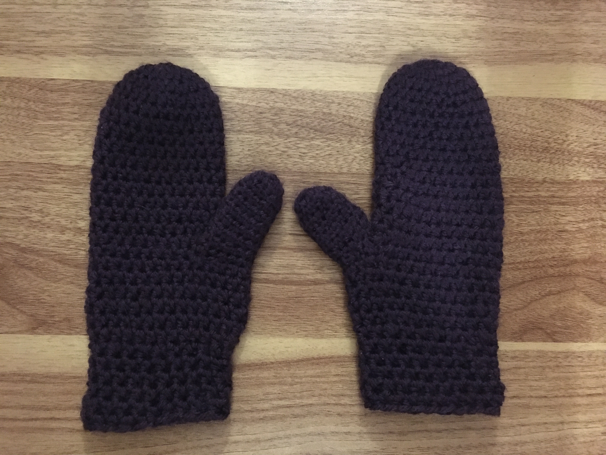
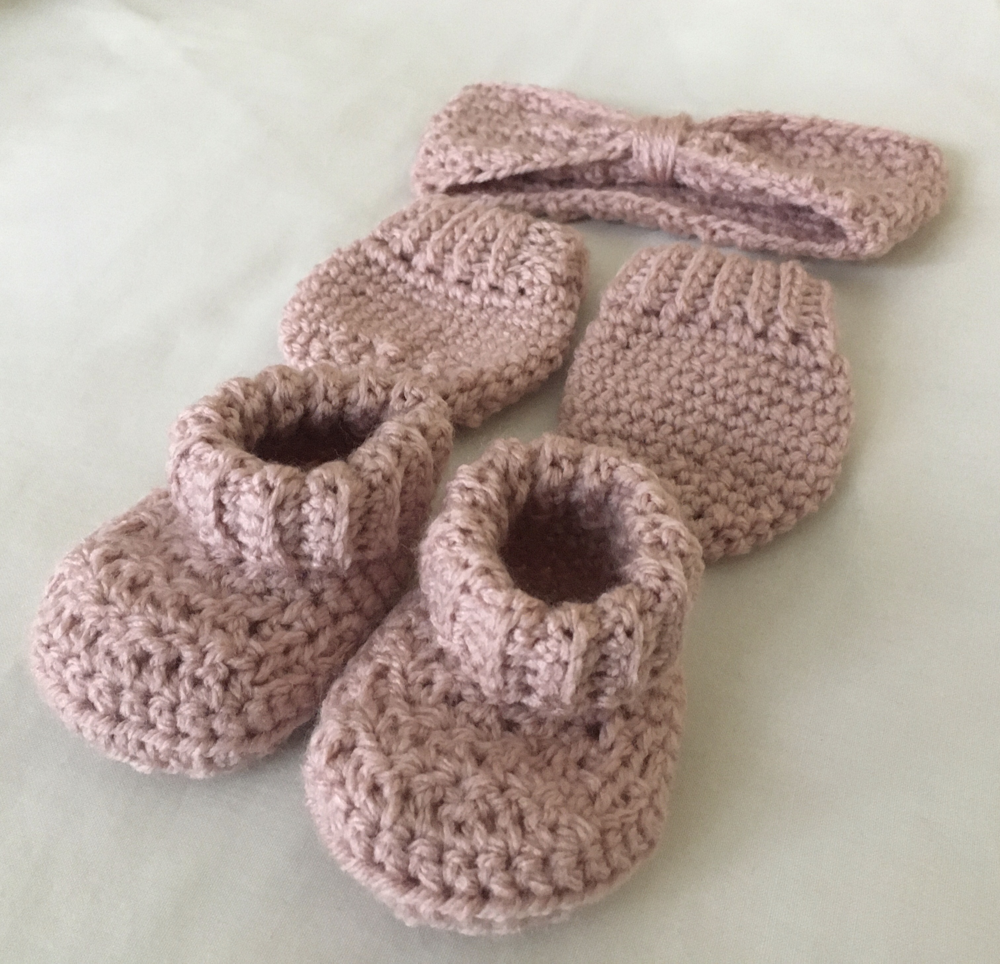

This crochet blog is a space where I showcase my projects; a 'grown-up' version of show and tell from school. I have included all the resources I used, so *feel free to try these out yourself.*

```
Some fun facts abouts me:

I love outdoor activities.
I am currently studying Computer Science.
My favourite type of TV shows are competitions (watching 'Hungry for It' at the moment). 
I grew up watching Studio Ghibli movies.
I have been crocheting since I was around 12 years old!
```

Here are a few pictures of my projects:





I have a kind of love hate relationship with this hobby and this quote pretty much sums it up XD:

> I hate crocheting
>
> I hate crocheting
>
> I hate crocheting
>
> It's finished!
>
> I love crocheting

This quote also works perfectly for my coding experience:

> I hate programming
>
> I hate programming
>
> I hate programming
>
> It's finished!
>
> I love programming


I coded this website during my CodeF week at RVU :) 

You can check out my gitHub page [over here](https://github.com/UAliyyah) to see more of my coding work.

**I hope you enjoy your time here, and learn something new.** 

And a little side note - crocheting is not as difficult as it seems (and coding is also very fun!) :D

